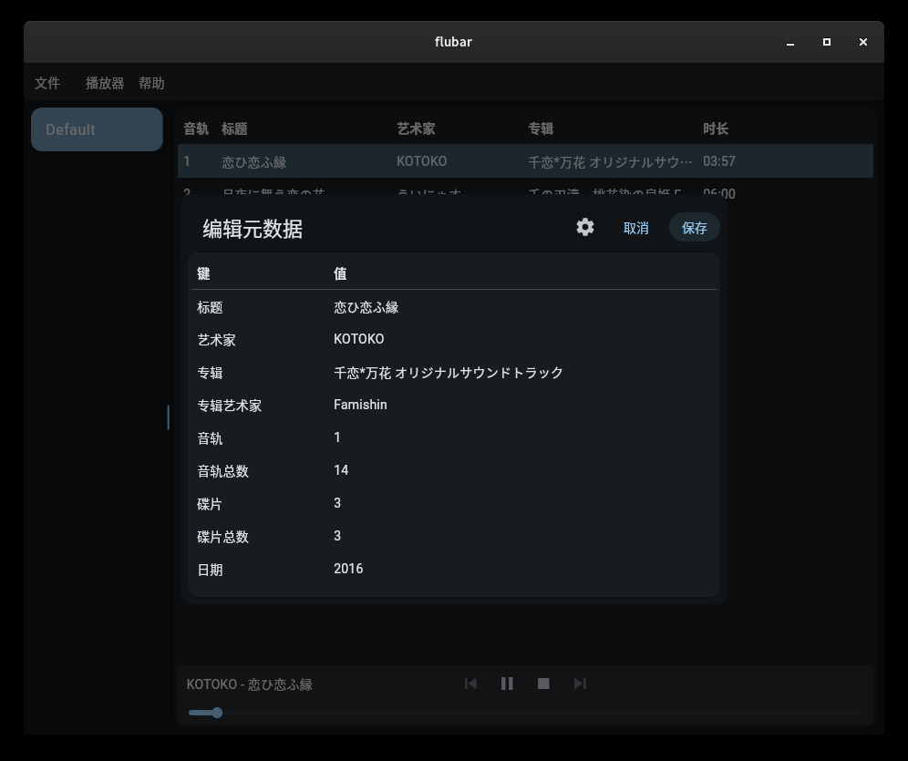
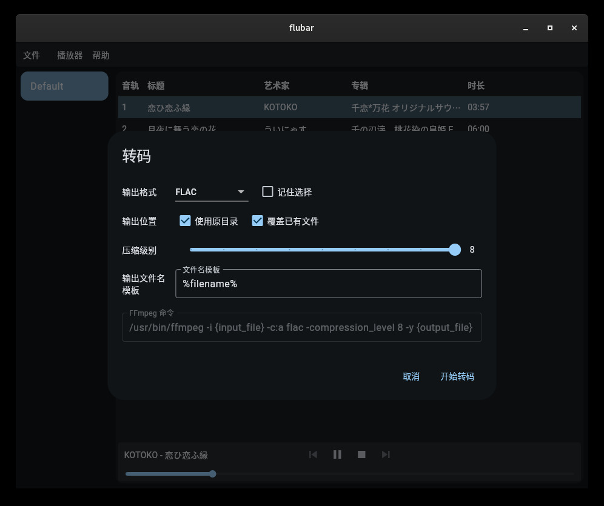

# flubar

audio helper written in flutter

<div style="display: flex; justify-content: center; align-items: center;">
  
  
</div>

## Build

```bash
sudo pacman -S base-devel clang cmake ninja gtk3 rustup
sudo pacman -S mpv pkg-config ffmpeg
rustup default stable
cd flubar
flutter pub get # make sure flutter sdk is installed
dart run build_runner build --delete-conflicting-outputs
flutter build linux --release
```

## Thanks

- [flutter_rust_bridge](https://github.com/fzyzcjy/flutter_rust_bridge), MIT
- [metadata_god](https://github.com/KRTirtho/metadata_god), MIT
- [lofty](https://crates.io/crates/lofty), MIT or Apache-2.0
- [id3](https://crates.io/crates/id3), MIT
- [ffmpeg-next](https://crates.io/crates/ffmpeg-next), WTFPL